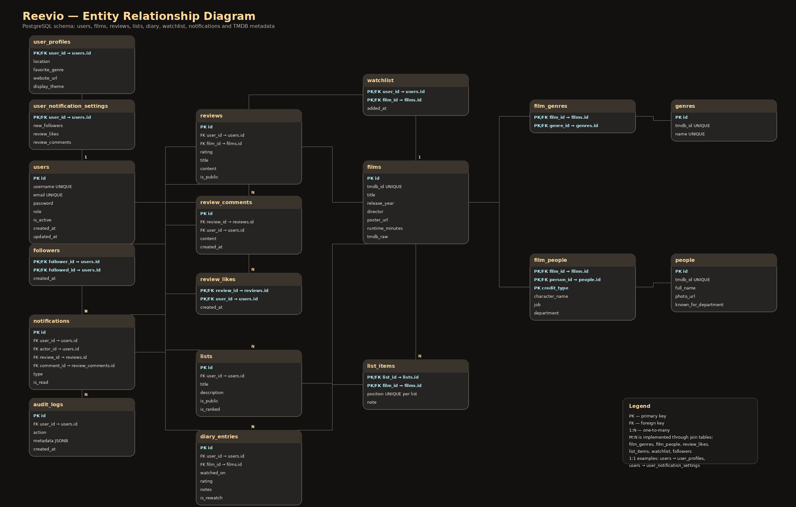

# Reevio

Reevio to aplikacja internetowa do katalogowania filmów, prowadzenia dziennika obejrzanych tytułów, tworzenia list filmowych, pisania recenzji oraz obserwowania aktywności innych użytkowników. Projekt został przygotowany jako aplikacja webowa w PHP z bazą danych PostgreSQL, uruchamiana w środowisku Docker.

Aplikacja łączy funkcje serwisu filmowego i społecznościowego: użytkownik może wyszukiwać filmy, dodawać je do watchlisty, oznaczać jako obejrzane, oceniać, recenzować, tworzyć listy oraz przeglądać profile innych osób.

---

## Spis treści

1. [Technologie](#technologie)
2. [Główne funkcjonalności](#główne-funkcjonalności)
3. [Architektura aplikacji](#architektura-aplikacji)
4. [Struktura projektu](#struktura-projektu)
5. [Instrukcja uruchomienia](#instrukcja-uruchomienia)
6. [Zmienne środowiskowe](#zmienne-środowiskowe)
7. [Konta testowe](#konta-testowe)
8. [Flow aplikacji](#flow-aplikacji)
9. [Baza danych](#baza-danych)
10. [Diagram ERD](#diagram-erd)
11. [Widoki, funkcje, triggery i transakcje](#widoki-funkcje-triggery-i-transakcje)
12. [Testy](#testy)
13. [Security Bingo](#security-bingo)
14. [Responsywność i design](#responsywność-i-design)
15. [Screeny aplikacji](#screeny-aplikacji)
16. [Checklista wymagań](#checklista-wymagań)

---

## Technologie

Projekt wykorzystuje:

- Docker i Docker Compose,
- Nginx jako serwer HTTP,
- PHP w podejściu obiektowym,
- PostgreSQL jako bazę danych,
- HTML5,
- CSS,
- JavaScript,
- Fetch API / AJAX,
- PHPUnit do testów jednostkowych,
- prosty skrypt shellowy do testów integracyjnych endpointów,
- integrację z TMDB API do pobierania danych o filmach i osobach.

Projekt nie korzysta z frameworka backendowego ani gotowego szablonu aplikacji. Struktura została przygotowana ręcznie w oparciu o kontrolery, repozytoria, serwisy i widoki.

---

## Główne funkcjonalności

Aplikacja obsługuje:

- rejestrację użytkownika,
- logowanie,
- sesję użytkownika,
- wylogowywanie,
- role użytkowników: zwykły użytkownik i administrator,
- panel administratora,
- wyszukiwanie filmów,
- wyszukiwanie osób z obsady i ekipy filmowej,
- szczegóły filmu,
- szczegóły osoby z obsady/ekipy,
- dodawanie filmu do watchlisty,
- oznaczanie filmu jako obejrzany,
- prowadzenie dziennika obejrzanych filmów,
- ocenianie filmów,
- rozkład ocen użytkownika,
- dodawanie recenzji,
- komentarze i polubienia recenzji,
- tworzenie publicznych list filmowych,
- listy rankingowe,
- dodawanie filmów do list,
- usuwanie pozycji z list,
- zmianę kolejności filmów na listach rankingowych,
- profile publiczne użytkowników,
- obserwowanie innych użytkowników,
- aktywność obserwowanych,
- powiadomienia,
- ustawienia profilu,
- ustawienia powiadomień,
- upload avatara,
- strony błędów 400, 403, 404 i 500,
- tryb offline przez service worker.

---

## Architektura aplikacji

Projekt działa w architekturze zbliżonej do MVC. Warstwa HTTP trafia do routera, następnie do kontrolerów, które korzystają z repozytoriów i serwisów. Widoki odpowiadają za prezentację danych użytkownikowi.

Prosty diagram warstwowy:

```txt
Browser
   ↓
Nginx container
   ↓
PHP application
   ↓
Controllers
   ↓
Repositories / Services
   ↓
PostgreSQL / TMDB API
```

Opis warstw:

- **Browser** — użytkownik korzysta z aplikacji przez przeglądarkę.
- **Nginx container** — obsługuje ruch HTTP i przekazuje żądania do PHP.
- **PHP application** — główna aplikacja backendowa.
- **Controllers** — przyjmują żądania, sprawdzają uprawnienia, przygotowują dane i wybierają widoki.
- **Repositories** — komunikują się z bazą danych PostgreSQL.
- **Services** — obsługują logikę zewnętrzną lub pomocniczą, np. integrację z TMDB.
- **PostgreSQL** — przechowuje użytkowników, filmy, recenzje, listy, dziennik, powiadomienia itd.
- **TMDB API** — zewnętrzne źródło danych o filmach, plakatach, opisach i osobach.

---

## Struktura projektu

Przykładowa struktura katalogów:

```txt
REEVIO/
├── docker/
│   ├── db/
│   │   ├── Dockerfile
│   │   └── init/
│   │       └── init.sql
│   ├── nginx/
│   │   └── Dockerfile
│   └── php/
│       └── Dockerfile
├── public/
│   ├── assets/
│   │   ├── css/
│   │   │   └── reevio.css
│   │   ├── js/
│   │   │   └── reevio.js
│   │   └── img/
│   ├── uploads/
│   └── views/
├── src/
│   ├── controllers/
│   ├── repositories/
│   ├── services/
│   └── ErrorHandler.php
├── tests/
│   ├── Unit/
│   └── Integration/
├── database/
│   └── reevio_dump.sql
├── docs/
│   ├── erd/
│   ├── screenshots/
│   └── security_bingo.md
├── composer.json
├── composer.lock
├── phpunit.xml.dist
├── docker-compose.yml
├── Routing.php
├── Database.php
├── index.php
└── README.md
```

Najważniejsze katalogi:

- `src/controllers/` — kontrolery aplikacji,
- `src/repositories/` — klasy odpowiedzialne za komunikację z bazą danych,
- `src/services/` — usługi pomocnicze, np. TMDB,
- `public/views/` — widoki HTML/PHP,
- `public/assets/css/` — style aplikacji,
- `public/assets/js/` — JavaScript i Fetch API,
- `docker/db/init/init.sql` — inicjalizacja bazy danych,
- `database/reevio_dump.sql` — eksport bazy danych,
- `tests/Unit/` — testy PHPUnit,
- `tests/Integration/` — testy endpointów.

---

## Instrukcja uruchomienia

### 1. Wejście do katalogu projektu

Windows PowerShell:

```powershell
cd C:\Users\kryst\Documents\WDPAI
```

Lub ogólnie:

```powershell
cd ścieżka\do\projektu
```

### 2. Przygotowanie zmiennych środowiskowych

Jeżeli w projekcie znajduje się `.env.example`, skopiuj go do `.env`:

```powershell
copy .env.example .env
```

W pliku `.env` ustaw własny token TMDB, jeśli chcesz korzystać z pobierania danych z API.

### 3. Uruchomienie kontenerów

```powershell
docker compose up --build -d
```

### 4. Sprawdzenie kontenerów

```powershell
docker compose ps
```

Oczekiwane usługi:

```txt
server
php
db
pgadmin-wdpai
```

Aplikacja powinna być dostępna pod adresem:

```txt
http://localhost:8080
```

PgAdmin powinien być dostępny pod adresem:

```txt
http://localhost:5050
```

### 5. Reset bazy danych

Jeżeli chcesz uruchomić projekt od zera i ponownie wykonać pliki inicjalizacyjne SQL:

```powershell
docker compose down -v
docker compose up --build -d
```

Uwaga: `down -v` usuwa wolumen bazy danych, więc wszystkie lokalne dane PostgreSQL zostaną odtworzone z plików SQL.

---

## Zmienne środowiskowe

Przykładowe zmienne środowiskowe:

```env
DB_HOST=db
DB_PORT=5432
DB_NAME=db
DB_USER=docker
DB_PASSWORD=docker

TMDB_ACCESS_TOKEN=
TMDB_API_BASE_URL=https://api.themoviedb.org/3
TMDB_IMAGE_BASE_URL=https://image.tmdb.org/t/p
TMDB_LANGUAGE=en-US
```

Opis:

- `DB_HOST` — nazwa usługi bazy danych w Docker Compose.
- `DB_PORT` — port PostgreSQL wewnątrz sieci Dockera.
- `DB_NAME` — nazwa bazy danych.
- `DB_USER` — użytkownik bazy danych.
- `DB_PASSWORD` — hasło do bazy danych.
- `TMDB_ACCESS_TOKEN` — token API TMDB.
- `TMDB_API_BASE_URL` — bazowy URL API TMDB.
- `TMDB_IMAGE_BASE_URL` — bazowy URL obrazów TMDB.
- `TMDB_LANGUAGE` — język danych pobieranych z TMDB.

Nie należy wrzucać prawdziwego pliku `.env`, `config.php` ani plików z kluczami API do repozytorium.

---

## Konta testowe

Przykładowe konta do prezentacji:

| Rola | Email | Hasło | Przeznaczenie |
|---|---|---|---|
| Administrator | `admin@reevio.test` | `Password123` | Test panelu administratora |
| Użytkownik demo | `demo@reevio.test` | `Password123` | Pełny profil z listami, watchlistą, dziennikiem i ocenami |
| Użytkownik standardowy | `jakub@reevio.test` | `password` / zgodnie z aktualnym seedem | Test zwykłego konta użytkownika |

Właściwe dane kont zależą od aktualnego pliku `docker/db/init/init.sql` lub `database/reevio_dump.sql`.

---

## Flow aplikacji

Podstawowy scenariusz użycia aplikacji:

1. Użytkownik wchodzi na stronę logowania.
2. Loguje się na konto.
3. Po zalogowaniu trafia do głównego feedu filmów.
4. Użytkownik wyszukuje film.
5. Wchodzi w szczegóły filmu.
6. Może dodać film do watchlisty.
7. Może oznaczyć film jako obejrzany.
8. Może wystawić ocenę.
9. Może dodać recenzję.
10. Może dodać film do własnej listy.
11. Może przejść do swojego profilu.
12. Na profilu widzi statystyki, ulubione filmy i rozkład ocen.
13. Może przejść do dziennika obejrzanych filmów.
14. Może przeglądać publiczne profile innych użytkowników.
15. Może obserwować innych użytkowników.
16. Może otrzymywać powiadomienia.
17. Administrator może wejść do panelu administratora i zarządzać użytkownikami.
18. Użytkownik może się wylogować.

---

## Baza danych

Projekt korzysta z PostgreSQL. Baza danych zawiera tabele związane z:

- użytkownikami,
- profilami użytkowników,
- ustawieniami powiadomień,
- filmami,
- gatunkami,
- osobami z obsady i ekipy,
- relacjami film-osoba,
- recenzjami,
- komentarzami,
- polubieniami,
- listami filmowymi,
- elementami list,
- dziennikiem obejrzanych filmów,
- watchlistą,
- ulubionymi filmami,
- obserwowaniem użytkowników,
- powiadomieniami,
- logami audytowymi.

Eksport bazy znajduje się w pliku:

```txt
database/reevio_dump.sql
```

Plik inicjalizacyjny dla Dockera:

```txt
docker/db/init/init.sql
```

---

## Diagram ERD

Miejsce na diagram ERD:

```txt
docs/erd/reevio_erd.png
docs/erd/reevio_erd.drawio
```

Po dodaniu diagramu można odkomentować lub uzupełnić poniższy fragment:

```md


Źródło diagramu: `docs/erd/reevio_erd.drawio`
```

### Najważniejsze relacje w bazie

Przykładowe relacje:

- `users` 1:1 `user_profiles`,
- `users` 1:N `reviews`,
- `users` 1:N `lists`,
- `users` 1:N `diary_entries`,
- `users` M:N `films` przez `watchlist`,
- `users` M:N `films` przez `user_favorite_films`,
- `films` M:N `genres` przez `film_genres`,
- `films` M:N `people` przez `film_people`,
- `reviews` 1:N `review_comments`,
- `reviews` M:N `users` przez `review_likes`,
- `users` M:N `users` przez `followers`,
- `users` 1:N `notifications`.

---

## Widoki, funkcje, triggery i transakcje

Baza danych zawiera elementy wymagane w projekcie.

### Widoki SQL

Przykładowe widoki:

- `v_review_feed` — widok łączący recenzje, użytkowników, filmy, komentarze i polubienia.
- `v_user_activity` — widok aktywności użytkowników.
- `v_user_statistics` — widok statystyk profilu użytkownika.

### Funkcje SQL

Przykładowe funkcje:

- `film_average_rating(p_film_id INTEGER)` — wylicza średnią ocenę filmu.
- `block_user(p_user_id INTEGER, p_blocked BOOLEAN)` — zmienia aktywność użytkownika i zapisuje akcję do audytu.
- `set_updated_at()` — aktualizuje pole `updated_at`.
- `notify_review_interaction()` — tworzy powiadomienia po interakcjach z recenzjami.

### Triggery

Przykładowe triggery:

- aktualizacja `updated_at` dla użytkowników,
- aktualizacja `updated_at` dla profili,
- aktualizacja `updated_at` dla list,
- aktualizacja `updated_at` dla recenzji,
- tworzenie powiadomień po komentarzu do recenzji,
- tworzenie powiadomień po polubieniu recenzji.

### Transakcje

W projekcie znajduje się przykład transakcji z poziomem izolacji, w której lista i jej elementy są tworzone atomowo.

Przykład zastosowania:

```sql
BEGIN TRANSACTION ISOLATION LEVEL REPEATABLE READ;
-- dodanie listy
-- dodanie elementów listy
COMMIT;
```

---

## Testy

Projekt zawiera testy jednostkowe PHPUnit i prosty test integracyjny endpointów.

### Instalacja zależności testowych

W kontenerze `php` nie ma Composera, dlatego zależności można zainstalować przez oficjalny obraz Composer:

```powershell
docker run --rm -v "${PWD}:/app" -w /app composer:2 install --ignore-platform-req=ext-pdo_pgsql
```

Ten krok tworzy katalog:

```txt
vendor/
```

Jeżeli `vendor/` już istnieje, nie trzeba wykonywać tej komendy po każdym `docker compose down -v`.

### PHPUnit

Uruchomienie testów jednostkowych:

```powershell
docker compose exec php sh -lc "cd /app && php vendor/bin/phpunit"
```

Przykładowy poprawny wynik:

```txt
PHPUnit 10.5.63 by Sebastian Bergmann and contributors.

....                                                                4 / 4 (100%)

OK (4 tests, 11 assertions)
```

Testy obejmują m.in.:

- logikę usług,
- normalizację wartości filmów przed zapisem,
- zachowanie wybranych metod repozytoriów.

### Smoke test endpointów

Uruchomienie testu integracyjnego endpointów:

```powershell
docker compose exec php sh -lc "cd /app && BASE_URL=http://server sh tests/Integration/endpoint_smoke.sh"
```

Wewnątrz Dockera używany jest adres:

```txt
http://server
```

ponieważ `server` to nazwa usługi Nginx w Docker Compose.

Przykładowy poprawny wynik:

```txt
OK   /login -> 200
OK   /offline-page -> 200
OK   /definitely-missing-route -> 404
OK   /bad-request -> 400
OK   JSON 404 body
```

---

## Security Bingo

Projekt realizuje wybrane zabezpieczenia z Security Bingo.

### Zrealizowana pełna linia

W projekcie została pokryta linia obejmująca:

- limit prób logowania,
- walidację złożoności hasła,
- sprawdzanie zajętego emaila/loginu przy rejestracji,
- escaping danych w widokach,
- brak surowych błędów i stack trace dla użytkownika.

### Dodatkowe zabezpieczenia

W projekcie zastosowano również:

- prepared statements i bind parameters dla zapytań SQL,
- ogólny komunikat błędnego logowania,
- walidację emaila po stronie serwera,
- obsługę logowania/rejestracji przez POST,
- CSRF token dla formularza logowania,
- CSRF token dla formularza rejestracji,
- ograniczenia długości wejścia,
- hasła przechowywane jako hash,
- brak logowania haseł,
- regenerację ID sesji po logowaniu,
- `HttpOnly` dla cookie sesyjnego,
- `SameSite=Lax` dla cookie sesyjnego,
- `Secure` dla cookie sesyjnego przy HTTPS,
- poprawne wylogowanie i niszczenie sesji,
- audyt nieudanych prób logowania bez zapisywania haseł,
- globalne strony błędów 400, 403, 404 i 500,
- JSON błędów dla endpointów API/AJAX,
- brak sekretów w repozytorium przez `.gitignore`.

Dokumentacja Security Bingo może znajdować się w:

```txt
docs/security_bingo.md
```

---

## Responsywność i design

Aplikacja posiada responsywny interfejs dostosowany do desktopu i urządzeń mobilnych.

Zastosowano m.in.:

- CSS media queries,
- responsywne siatki kart,
- mobilne menu,
- dostosowane widoki profili,
- responsywne listy i watchlisty,
- poziome przewijanie w wybranych sekcjach,
- poprawki dla małych ekranów,
- osobne style dla szczegółów filmu, profili, list i rating distribution.

Design aplikacji jest utrzymany w ciemnym, filmowym stylu z kartami, gradientami, dużymi plakatami i widokami dopasowanymi do tematyki kina.

---

## Screeny aplikacji

Miejsce na screeny aplikacji.

Proponowana struktura:

```txt
docs/screenshots/web/login.png
docs/screenshots/web/feed-films.png
docs/screenshots/web/film-details.png
docs/screenshots/web/profile.png
docs/screenshots/web/admin-panel.png

docs/screenshots/mobile/login.png
docs/screenshots/mobile/feed-films.png
docs/screenshots/mobile/film-details.png
docs/screenshots/mobile/profile.png
docs/screenshots/mobile/search.png
```

Po dodaniu screenów można uzupełnić sekcję:

### Wersja desktop

```md


```

### Wersja mobilna

```md


```

---

## Przykładowy scenariusz testowy

1. Uruchom aplikację przez Docker.
2. Wejdź na `http://localhost:8080`.
3. Zarejestruj nowego użytkownika albo zaloguj się na konto testowe.
4. Sprawdź, czy sesja użytkownika działa po odświeżeniu strony.
5. Wyszukaj film.
6. Wejdź w szczegóły filmu.
7. Dodaj film do watchlisty.
8. Oznacz film jako obejrzany.
9. Wystaw ocenę.
10. Dodaj recenzję.
11. Dodaj komentarz do recenzji.
12. Utwórz listę filmową.
13. Dodaj film do listy.
14. Zmień kolejność filmów na liście rankingowej.
15. Wejdź na profil użytkownika.
16. Sprawdź rozkład ocen.
17. Wejdź na profil publiczny innego użytkownika.
18. Zaobserwuj użytkownika.
19. Sprawdź powiadomienia.
20. Wyloguj się.
21. Zaloguj się jako administrator.
22. Wejdź do panelu administratora.
23. Sprawdź zarządzanie użytkownikami.
24. Wejdź na nieistniejącą trasę i sprawdź błąd 404.
25. Wejdź na niedozwolony zasób i sprawdź błąd 403.
26. Uruchom testy PHPUnit.
27. Uruchom smoke test endpointów.

---

## Checklista wymagań

| Wymaganie | Status |
|---|---|
| Dokumentacja w README.md | Zrealizowane |
| Docker | Zrealizowane |
| Architektura MVC / front-backend | Zrealizowane |
| Backend obiektowy PHP | Zrealizowane |
| Diagram ERD | Miejsce przygotowane, należy dodać pliki diagramu |
| Git i commity | Do potwierdzenia w repozytorium |
| Realizacja tematu | Zrealizowane |
| HTML5 | Zrealizowane |
| CSS | Zrealizowane |
| JavaScript | Zrealizowane |
| Fetch API / AJAX | Zrealizowane |
| PostgreSQL | Zrealizowane |
| Złożoność bazy danych | Zrealizowane |
| Eksport bazy do `.sql` | Zrealizowane |
| Logowanie | Zrealizowane |
| Sesja użytkownika | Zrealizowane |
| Uprawnienia użytkowników | Zrealizowane |
| Role użytkowników, minimum dwie | Zrealizowane |
| Wylogowywanie | Zrealizowane |
| Widoki SQL | Zrealizowane |
| Wyzwalacze SQL | Zrealizowane |
| Funkcje SQL | Zrealizowane |
| Transakcje | Zrealizowane |
| Akcje na referencjach | Zrealizowane |
| Security Bingo | Częściowo zrealizowane, pełna linia pokryta |
| Brak duplikacji kodu | W dużej części zrealizowane |
| Testy PHPUnit | Zrealizowane |
| Testy integracyjne endpointów | Zrealizowane |
| Globalna obsługa błędów 400/403/404/500 | Zrealizowane |
| Responsywność | Zrealizowane |
| Design | Zrealizowane |

---

## Przydatne komendy do prezentacji

Start projektu:

```powershell
docker compose up --build -d
```

Status kontenerów:

```powershell
docker compose ps
```

Reset bazy:

```powershell
docker compose down -v
docker compose up --build -d
```

Instalacja zależności testowych:

```powershell
docker run --rm -v "${PWD}:/app" -w /app composer:2 install --ignore-platform-req=ext-pdo_pgsql
```

PHPUnit:

```powershell
docker compose exec php sh -lc "cd /app && php vendor/bin/phpunit"
```

Smoke test endpointów:

```powershell
docker compose exec php sh -lc "cd /app && BASE_URL=http://server sh tests/Integration/endpoint_smoke.sh"
```

Logi bazy danych:

```powershell
docker compose logs db --tail=120
```

Logi PHP:

```powershell
docker compose logs php --tail=120
```

Logi serwera:

```powershell
docker compose logs server --tail=120
```

---

## Uwagi dotyczące repozytorium

Do repozytorium należy dodać:

```txt
composer.json
composer.lock
phpunit.xml.dist
tests/
src/
public/
docker/
database/
docs/
README.md
```

Nie należy dodawać:

```txt
vendor/
.env
.env.local
config.php
public/uploads/
docker-compose.yml z prawdziwymi sekretami
docker-compose.yaml z prawdziwymi sekretami
```

Jeżeli plik Docker Compose zawiera prywatny klucz API, najlepiej dodać do repozytorium wersję przykładową, np.:

```txt
docker-compose.example.yml
```

a lokalny plik z sekretami trzymać poza repozytorium.

---

## Autor

Projekt przygotowany w ramach przedmiotu **Wstęp do Projektowania Aplikacji Internetowych**.
